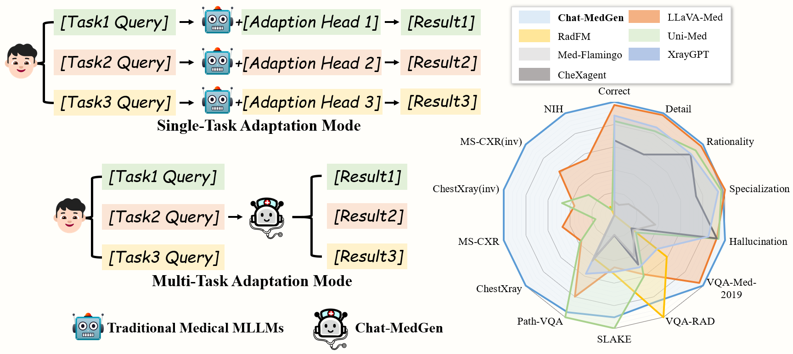
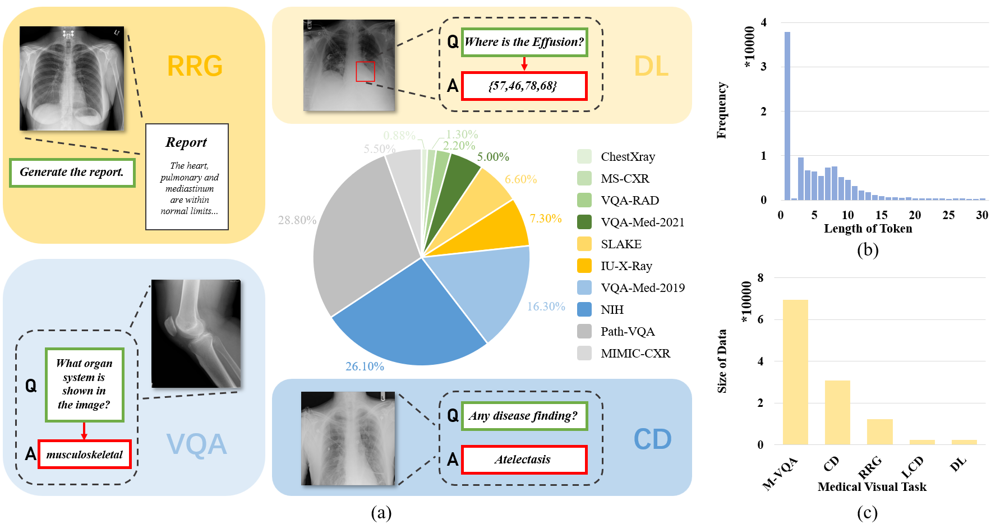
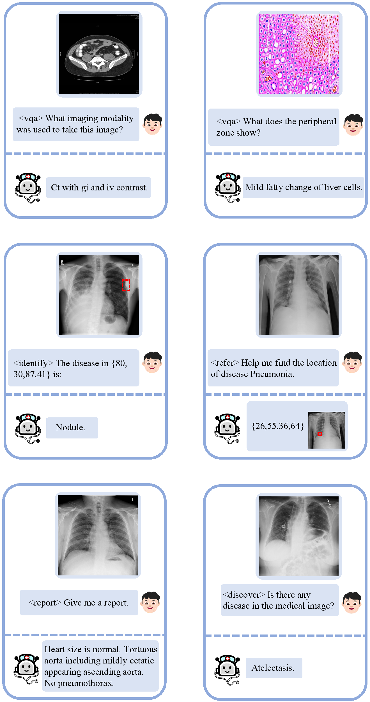
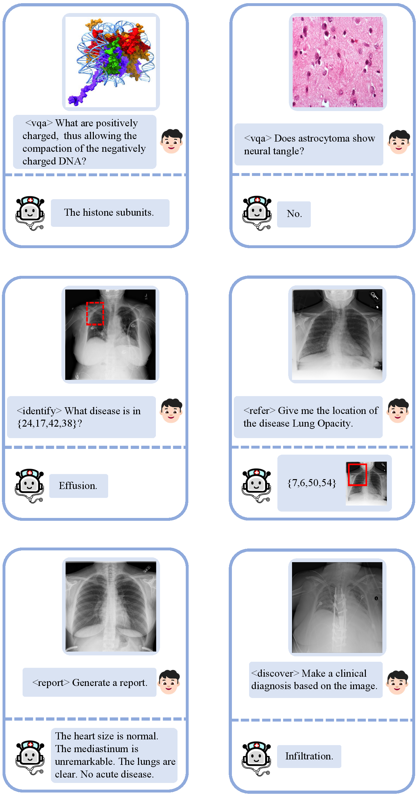

<p align="center">

  <h2 align="center">
  Chat-MedGen: Omni-Adaptation of Multi-Modal Large Language Models for Diverse Biomedical Tasks
  
  (Knowledge-Based Systems 2025)

  </h2>
  <p align="center">
    <a><strong>Qinyue Tong</strong></a><sup>1</sup>
    ·
    <a href="https://scholar.google.com/citations?user=qx1yRVEAAAAJ&hl=zh-CN"><strong>Ziqian Lu</strong></a><sup>2*</sup>
    ·
    <a href="https://person.zju.edu.cn/lzmhome"><strong>Zhe-ming Lu</strong></a><sup>1*</sup>
    <br>
    <a href="https://person.zju.edu.cn/en/yunlong"><strong>Yunlong Yu</strong></a><sup>1</sup>
    ·
    <a><strong>Jun Liu</strong></a><sup>1</sup>
    ·
    <a href="https://person.zju.edu.cn/zymsun2002"><strong>Yangming Zheng</strong></a><sup>1</sup>
    <!-- <br> -->
    <br>
    <sup>1</sup>Zhejiang University, <sup>2</sup>Zhejiang Sci-Tech University, <sup>*</sup>Corresponding author
    <br>
    <div align="center">
    <a href='https://huggingface.co/Carryyy/Chat-MedGen'></a>
    <a href='https://huggingface.co/datasets/Carryyy/MedVision-MT'></a>
    </div>
  </p>
</p>
  


## :mega: News
- **2025.9.30**: We released the ***MedVision-MT*** benchmark! You can use it in your research or evaluate Chat-MedGen on it.
- **2025.9.27**: We released the ***inference codes***. Feel free to chat with Chat-MedGen on your own data!
- **2025.9.26**: We released the ***pretrained weights of Chat-MedGen***. You can find it in the Hugging Face.
- **2025.7.25**: We created the ***Chat-MedGen*** project and upload the demo video of Chat-MedGen.

## :memo: ToDo List
- [ ] Release training codes.
- [x] Release ***inference codes*** and Chat-MedGen model ***pre-trained weights***. 
- [x] Release ***MedVision-MT*** benchmark.
- [x] Release more ***visual results and video demo***.

## :camera: Video Demo 


## MedVision-MT Benchmark
We release our **MedVision-MT** benchmark [here](https://huggingface.co/datasets/Carryyy/MedVision-MT) to provide a standard evaluation and inspire further research in medical MLLMs.



## Getting Started
### Installation

**1. Prepare the code and the environment**

Git clone our repository, creating a python environment and activate it via the following command

```bash
git clone https://github.com/Edisonhimself/Chat-MedGen.git
cd Chat-MedGen
conda env create -f environment.yml
conda activate chatmedgen
```

**2. Prepare the pretrained LLM weights**

**Chat-MedGen** is based on Llama2-7B. Please first download the LLM weights from the following huggingface space:
[Download](https://huggingface.co/meta-llama/Llama-2-7b-chat-hf/tree/main).

Then, set the variable *llama_model* in the model config file to the LLM weight path. Specifically, please set the LLM path 
[here](chatmedgen/configs/models/chatmedgen.yaml#L14) at Line 14.


**3. Prepare our Chat-MedGen pretrained model checkpoints**

Download the pretrained model checkpoints at [Download](https://huggingface.co/Carryyy/Chat-MedGen/tree/main).

Then, set the variable *ckpt* in the eval config file to the pretrained Chat-MedGen weight path. Specifically, please set the ckpt path 
[here](eval_configs/chat_medgen_eval.yaml#L11) at Line 11.


### Launching Chat-MedGen Locally and get a quick start
Please set your image and your query in [here](chat_medgen_eval.py#L51) and run:
```
torchrun chat_medgen_eval.py --cfg-path eval_configs/chat_medgen_eval.yaml --gpu-id 0
```

We provide two examples in the *examples* folder to help you get started quickly.


## Evaluate Chat-MedGen on MedVision-MT

You can first download the **MedVision-MT** dataset from [here](https://huggingface.co/datasets/Carryyy/MedVision-MT).

**Notice:** The downloaded MedVision-MT dataset only contains image metadata and corresponding annotations. To obtain the actual image files, please download them from the respective sub-datasets. We will provide a consolidated list of all sub-dataset download links in the near future to facilitate easier access.

Then, you can modify the *TestEvalData* class in the *eval_demo.py* file to point to the dataset you want to test. This will allow you to run the evaluation on your chosen dataset.

The structure of MedVision-MT is shown below:
```
MedVision-MT/
├── chestxray/
│   ├── train.json
│   └── test.json
├── iu_xray/
│   ├── train.json
│   └── test.json
├── slake/
│   ├── train.json
│   └── test.json
├── ...  # Other folders (folder4, folder5, ..., folder12)
```


## :v: More Examples




## :clap: Acknowledgements
This project is developed on the codebase of [MiniGPT-4](https://github.com/Vision-CAIR/MiniGPT-4). We appreciate its valuable contributions! 
